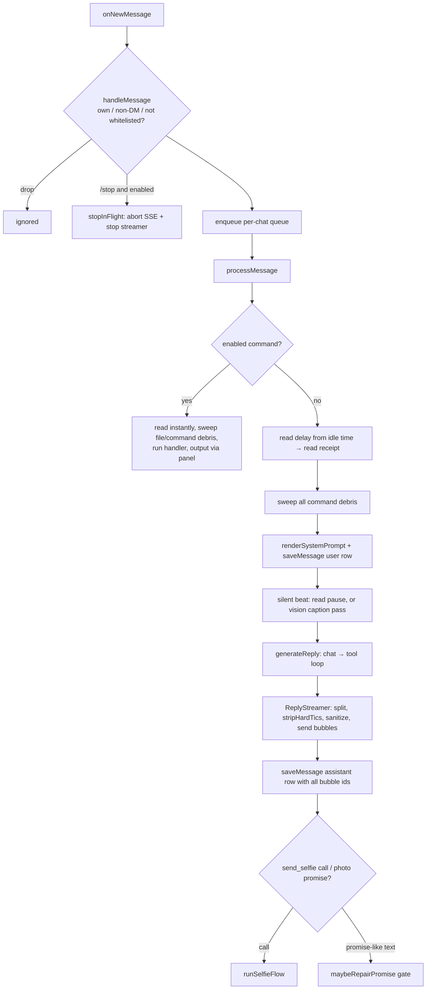

# Architecture overview

One process (`src/index.ts`) holds an mtcute `TelegramClient` logged in as a user account, a
SQLite database, and an LLM provider chosen at startup. Every incoming DM from a whitelisted user
goes through the pipeline below. Background loops (summaries, facts, diary, proactive) run on
their own intervals.

## Startup

`main()` in `src/index.ts`, in order:

1. `runMigrations()` applies `drizzle/` migrations.
2. `initPersona()` loads the newest `persona_versions` row, seeding the table from
   `prompts/system/persona.default.txt` if it's empty.
3. `initSettings()` loads the singleton `settings` row (character name, selfie upscale toggle).
4. `initProvider()` (`src/llm.ts`) probes llama.cpp at `LOCAL_LLM_BASE_URL`. If it's reachable,
   llama.cpp becomes the chat provider; otherwise OpenRouter if `OPENROUTER_API_KEY` is set. The
   choice is made **once**; there is no mid-session re-probe.
5. `client.start()` logs in (using the session from `pnpm login`) and logs `Logged in as …`.
6. The message handler is attached, then the proactive loop (only if `PROACTIVE_ENABLED`), the
   summary, facts and diary loops (each a no-op unless enabled and OpenRouter is configured).
7. It logs `UserBot is online and listening for messages.`

Importing `src/prompts/index.ts` reads every `prompts/**/*.txt` eagerly, and `src/schedule.ts`
parses `schedule.txt` at import. A missing or malformed prompt file fails the boot rather than a
later request.

## The message pipeline

### 1. Gate (`handleMessage`)

Outgoing messages, non-private chats and non-whitelisted senders are dropped before any queueing.
`/stop` is handled here, **outside** the queue, when it's enabled by `CHAT_COMMANDS`. Queued, it
would only run after the generation it's meant to interrupt. `stopInFlight` (`src/inflight.ts`)
aborts the in-flight SSE request and flips the streamer's stop flag. Bubbles that already landed
are kept and persisted by the generation's own partial-failure path.

### 2. Per-chat queue (`src/queue.ts`)

Everything stateful for a chat (incoming messages, proactive evaluations) runs on one promise
chain per chat, strictly in order. That keeps history alternating and stops a reach-out from
racing a reply. Messages that arrive mid-generation (or during a selfie render) wait their turn.

### 3. Command routing

`parseCommand` only applies to text (a photo caption is never a command). A parsed command runs
only if `isCommandEnabled(name)` passes. A disabled command is not a command at all: its text goes
to the model like any other message. Enabled commands are read instantly, with no pacing. They
don't reset the proactive timer, and their output goes through the panel. See
[control-plane.md](control-plane.md).

### 4. Pacing (`src/pacing.ts`)

- Unsupported media (no text, no photo) is read instantly and dropped.
- A photo is dropped if nothing can caption it (`canCaptionImages()`). If it had no caption
  text either, it's read instantly and there's no reply.
- Otherwise the **read delay** is computed from how long the chat has been idle (last message
  from either side): 0 within `READ_DELAY_THRESHOLD` minutes, then a sqrt ramp to
  `READ_DELAY_MAX` seconds at `READ_DELAY_FULL_AT` minutes, ±30% jitter. Past 10 minutes idle
  there's a `READ_DELAY_INSTANT_CHANCE` roll for a 2-3 s read. Time the message already spent
  queued is subtracted.
- The read receipt is sent, `onUserActivity` resets the proactive schedule, and all command
  debris is swept.
- **Silent beat** before "typing…": for text, `min(READ_PAUSE_MAX_MS, base + len × perChar)`.
  For a photo, the vision pass runs inside a 1-2 s beat (wait = max(caption pass, beat)). The
  caption is stored in `attachments`.

### 5. System prompt assembly (`src/prompts/render.ts`)

`renderSystemPrompt` joins `SYSTEM_PROMPT_PARTS` in this exact order, dropping parts that render
empty:

| # | Key | Source | Notes |
|:--|:--|:--|:--|
| 1 | `persona` | newest `persona_versions` row | user-owned; edited via `/persona` |
| 2 | `appearance` | `prompts/system/appearance.txt` | her look in prose |
| 3 | `technical` | `prompts/system/technical.txt` | app limits; photo-record and bracket rules |
| 4 | `facts` | `facts` table → `# About <user>` | every live fact, grouped by category |
| 5 | `memory` | `summaries` table → `# Memory` | newest `SUMMARY_MAX_KEPT` daily summaries; omitted for reach-outs |
| 6 | `tools` | `prompts/tools/tools.txt` + available tools | empty when no tool is configured |
| 7 | `selfie` | `prompts/tools/selfie.txt` | only while `send_selfie` is available |

Every part goes through `substitute()`: `{{char}}`, `{{user}}`, `{{date}}`, `{{day}}`,
`{{period}}`, plus valued date tags `{{days-since:YYYY-MM-DD}}`, `{{days-until:…}}`, `{{age:…}}`,
`{{since:…}}`. Unknown tags are left as-is so typos stay visible. `/prompt`, `/dump` and the live
payload all walk the same array.

The per-minute clock is deliberately **not** in the system prompt. It rides the tail cue, the
only place a per-minute value fits without breaking prompt-prefix reuse. The date tags above
only change per day or per period.

### 6. Context window (`src/memory.ts` `getWindowDetailed`)

- **Size.** `windowSize(n)` over non-deleted rows: all rows up to 60, then it grows 60 → 79 and
  snaps back to 60 every 20 messages (`MIN_WINDOW = 60`, `STEP = 20`). Between snaps the older
  prefix stays byte-identical, so the llama.cpp KV cache is reused.
- **User turns.** Photo captions are prepended as `[<user> sent a photo: …]` (numbered when
  there are several). Search results are appended as
  `[you already searched the web for "…" - results: …]`.
- **Assistant turns.**
  1. `stripModelBrackets` removes any `[…]` block she wrote herself. Only the builder writes
     brackets into model input.
  2. `scrubTics` launders her tics (see [tics.md](tics.md)). A reply that was nothing but
     absence reproach becomes empty, and that turn is dropped.
  3. A selfie row expands into three turns: the verbatim `send_selfie` tool call, a user-role
     `[photo sent]`, and the caption she sent.
- Everything is passed through `sanitize()`.
- **Merging.** `withSystem` → `mergeConsecutive` (`src/providers/types.ts`) collapses
  consecutive same-role turns with a blank line between them, because chat templates expect
  strict alternation.

The DB and the chat are never rewritten by any of this. It only shapes model input.

### 7. Tail cue (`src/generate.ts` `withReplyCue`)

Ephemeral text appended to the **last user turn** of every reactive generation. It's never
stored. It's one bracketed `[System note: …]`, and each clause is spliced in before the closing
`]` in this order (later clauses carry more weight, so the order is load-bearing):

1. **Length rule**: 1-3 casual sentences, up to 5 if there's a lot to answer, longer only on
   request (`replyFormatCue`).
2. **Anti-echo**: start with her own reaction; never open by agreeing or restating his point.
3. **Clock**: `Now: <weekday>, <d Mon yyyy>, <HH:MM> (<period>).`
4. **Gap heads-up** (`gapHeadsUpClause`): when the conversation above went quiet ≥ 45 min ago
   (measured past the trailing run of rows younger than 10 min, by `conversationGapMs`). It says
   "about an hour" or "about N hours ago". From 24 h on it says "from an earlier day", with no
   number.
5. **Schedule** (`scheduleClause`): "Going by his usual routine, <user> is probably <text> right
   now (until ~HH:MM)." Only when `schedule.txt` has a block for now.
6. **Tic avoid-list** (`avoidListClause`, via `avoidListFor`): "Lately you've leaned on: …". Only
   when something is over threshold.
7. **Reroll angle** (`rerollAngleCue`): only on `/reroll`.
8. **Selfie sentence** (`SELFIE_FORMAT_CUE`): only while `send_selfie` is offered. Always last.

Proactive openers and `/continue` don't use this cue. Their director cues carry their own
brevity rule (see [proactive-and-tools.md](proactive-and-tools.md)).

### 8. Generation and tool loop (`generateReply`)

`chat()` (`src/llm.ts`) delegates to the active provider. Both providers call
`openaiChatCompletionStream`, the only transport: an OpenAI-compatible `/chat/completions` with
`stream: true`, parsed as SSE. Reasoning is turned off (`chat_template_kwargs.enable_thinking:
false` for llama.cpp, `reasoning.enabled: false` for OpenRouter). The request is capped by
`LLM_TIMEOUT_MS` and combined with the `/stop` abort signal.

If the completion parses as a `web_search` `<tool_call>` and Tavily is configured, the search
runs. The reactive strategy stores the result against the user row, the window is rebuilt (now
including the search record), and the model is called again, up to `TAVILY_MAX_SEARCHES`
searches per turn. A `send_selfie` call ends the loop and is handled after the reply is sent.

### 9. Streaming (`src/send.ts`, `src/chunker.ts`)

`ReplyStreamer.onToken` is the token sink:

- Each completion is sniffed from its first non-space characters. A pass starting with
  `<tool_call>` is suppressed entirely. In prose mode, a rolling guard holds back any tail that
  could be the start of `<tool_call>`, and drops everything from a confirmed marker onward. That
  covers the selfie shape: an ack line followed by the call.
- `SentenceSplitter` cuts bubbles at runs of `.?!\n` that are confirmed by following whitespace,
  a newline, or end of text (so `3.14` doesn't split). Trailing dots are stripped and fenced code
  blocks stay whole.
- Each bubble goes through `stripHardTics` → `sanitize` → re-split, then `renderMarkdown`
  (single-asterisk italics are rewritten for mtcute's `md`).
- Before each bubble the streamer waits
  `min(STREAMING_DELAY_MAX_MS, base + len × perChar)` minus time already elapsed, keeping
  "typing…" up during the wait.
- `finalize()` flushes the tail. If nothing was streamed (for example a bare tool call), it sends
  the caller's finalized text as bubbles instead.

### 10. Save

`finalizeReply` (`src/tools.ts`) strips any leftover tool call (falling back to
`NO_ANSWER_FALLBACK` if nothing remains) and applies `stripHardTics`, so the stored row matches
what was streamed. One `messages` row holds the whole reply, every bubble id
(`tg_message_ids`), the provider and the served model. `saveMessage` sanitizes again; the
function is idempotent.

Then:

- A parsed `send_selfie` call → `runSelfieFlow`. A bare call with no prose first gets an
  `ackLine` ("hang on").
- No call, but the reply contains a fake `[you sent a photo …]` block or reads like a photo
  promise → `maybeRepairPromise`.

On failure: if any bubbles were sent, they are persisted as the reply. A `/stop` abort is silent.
Otherwise an apology is shown in the panel.

## Providers

| | llama.cpp (`src/providers/llamacpp.ts`) | OpenRouter (`src/providers/openrouter.ts`) |
|:--|:--|:--|
| Chosen when | reachable at startup | local unreachable and `OPENROUTER_API_KEY` set |
| Vision | `/props` `modalities.vision` (an `--mmproj` projector) | model metadata from `/models` |
| Token count | exact, via `/apply-template` + `/tokenize` | `gpt-tokenizer` estimate |
| Extras | `enable_thinking: false` | provider routing (`order`/`sort`/`allow_fallbacks`), `reasoning.enabled: false`, routed through `PROXY_URL` when it is http(s) |

Side passes always use OpenRouter with their own model slug, whatever the chat provider is:
`summarize`, `factsPass`, `booruPass`, `captionImage` (the vision fallback), and `diaryEntry`
(which uses the chat slug and routing).

## Module map

| File | Role |
|:--|:--|
| `src/index.ts` | Entry point: Telegram client, `handleMessage`/`processMessage`, startup, shutdown |
| `src/config.ts` | Loads `.env`, sets `process.env.TZ`, parses and validates every setting |
| `src/queue.ts` | Per-chat serial promise queue |
| `src/inflight.ts` | Registry of interruptible generations for `/stop` |
| `src/pacing.ts` | Read delay, read→typing pause, photo beat |
| `src/typing.ts` | Keeps "typing…" alive while a function runs |
| `src/generate.ts` | `generateReply` tool loop, `withReplyCue`, reactive/ephemeral search strategies, `avoidListFor` |
| `src/llm.ts` | Provider facade: picks llama.cpp or OpenRouter at startup; caption routing |
| `src/providers/types.ts` | Shared SSE chat-completion transport, `mergeConsecutive`, caption messages |
| `src/providers/llamacpp.ts` | Local llama.cpp provider |
| `src/providers/openrouter.ts` | OpenRouter provider plus the one-shot side-pass calls |
| `src/proxyAgent.ts` | undici `ProxyAgent` from `PROXY_URL` (http/https only) for OpenRouter and Tavily |
| `src/prompts/index.ts` | Every model-facing string: prompt file loads, block headers, tail and director cues, record formats |
| `src/prompts/render.ts` | `{{tag}}` substitution, `SYSTEM_PROMPT_PARTS`, `renderSystemPrompt`, facts/memory blocks |
| `src/memory.ts` | All conversation DB access: save/update rows, context window, day transcripts, summaries/facts/proactive state |
| `src/send.ts` | `ReplyStreamer`: streaming bubbles, tool-call suppression, pacing |
| `src/chunker.ts` | Sentence splitter for bubbles |
| `src/format.ts` | Markdown rendering for mtcute; 24 h timestamps |
| `src/sanitize.ts` | Idempotent typography cleanup (dashes, quotes, ellipsis, NBSP) |
| `src/tics.ts` | Verbal-tic control: `scrubTics`, `stripHardTics`, `avoidListClause` |
| `src/tools.ts` | Tool registry, `<tool_call>` parsing/stripping, `finalizeReply` |
| `src/search.ts` | Tavily `web_search` backend and usage lookup |
| `src/selfie.ts` | `send_selfie`: booru pass, ComfyUI workflow, RunPod client, selfie flow, promise gate |
| `src/schedule.ts` | Parses `schedule.txt`; `scheduleNow()` |
| `src/proactive.ts` | Reach-out state machine, director cues, `/continue`, `/proactive test` |
| `src/summary.ts` | Nightly daily-summary scheduler; logical-day arithmetic |
| `src/facts.ts` | Nightly facts diff pass: parse and apply ops |
| `src/diary.ts` | Diary channel scheduler and prompt assembly |
| `src/commands.ts` | Command registry, all handlers, `isCommandEnabled`, `CHAT_COMMANDS` validation |
| `src/panel.ts` | Panel message and command-debris tracking/sweeping |
| `src/persona.ts` | Versioned persona (`persona_versions`) with set/undo/default |
| `src/settings.ts` | Singleton runtime settings (character name, selfie upscale) |
| `src/db/index.ts` | better-sqlite3 connection (WAL, foreign keys), drizzle instance, migrations |
| `src/db/schema.ts` | All tables, message kinds, fact categories |
| `src/logger.ts` | Minimal timestamped console logger |
| `src/login.ts` | One-time interactive login (`pnpm login`) |
